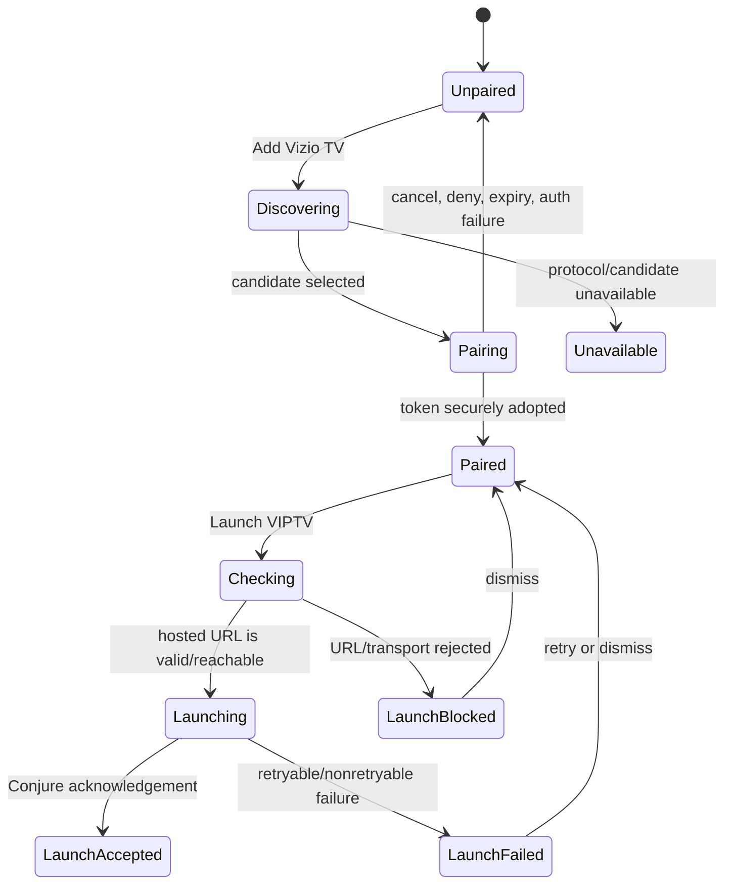

# Responsive mobile web and Tauri desktop UI

**Appearance override:** [RESPONSIVE_VIPTV_ALIGNMENT.md](RESPONSIVE_VIPTV_ALIGNMENT.md) specifies the owner-directed VIPTV component styling in this layout, superseding earlier circular controls, small typography, and OLED surface differences.

**Status:** approved responsive layout contract. Current real viewing-client adoption and its precise scope are recorded in [RESPONSIVE_PRODUCTION.md](RESPONSIVE_PRODUCTION.md); study-specific statements below describe the historical exploration, not current app status. Android phone remains a native Compose renderer. Source evidence is the frozen Roku contract at `vynxc/viptv@7d6b413` and the [generated wire bridge at `viptv-org/core@d1897fb`](https://github.com/viptv-org/core/blob/d1897fb8fc0401368074698f6b49f1941823f5e5/generated/typescript/wire.ts). Related delivery issues are design [#3](https://github.com/viptv-org/design/issues/3), [#4](https://github.com/viptv-org/design/issues/4), [#5](https://github.com/viptv-org/design/issues/5), and [#6](https://github.com/viptv-org/design/issues/6).

The [responsive study](https://github.com/viptv-org/design/tree/64d255d50257642c93ad5c6202aed4b0d93b3065/prototypes/responsive) is a static, local-fixture exploration. It has real Rust presentation fixtures and a typed wire snapshot, but simulated sources, profiles, playback, SmartCast, mutations, and persistence. It is evidence of neither application adoption nor production behaviour. This document distinguishes the study's implemented subset from the future normative inventory.

## Product rules

1. Phone web and Tauri desktop are ordinary vertically scrolling documents. A route has one main document scroll; rails, horizontal shelves, guide timelines, and modal interiors may scroll in their stated axis. Home does not import TV's separately clipped shelf viewport or fixed hero behaviour.
2. All platforms use the same semantic card: identity, image role, title, episode/context label, progress, fallback, focus/selection treatment, and eligible actions. Card width, row/grid placement, navigation method, and renderer remain platform-specific.
3. `MediaPresentation.heroImage` is the correct explicit core-selected hero input. A responsive renderer uses it in an explicit decorative ``/image component, with `object-fit: contain`, empty alternative text, and a stable neutral fallback. It must not use it as a CSS background image or invent a hero from `MediaItem.poster`.
4. There are no gradient overlays in this responsive direction. Text sits in its own content column or contained surface; artwork never supplies required text contrast. Missing art leaves title, facts, copy, and actions readable on `canvas`.
5. Manual Sources, exact-source Resume, controlled Next, queue/previous-episode identity, profile restrictions, and the direct-first recovery ladder keep their current semantic meaning. Responsive layout does not select a different source or silently alter playback intent.
6. Android mobile remains Compose. It may share semantic models, artwork roles, card tokens, OLED policy, and acceptance IDs; this does not prescribe WebView adoption.
7. OLED black is proposed for every renderer. It changes neutral chrome only; it does not dim or alter artwork/video, claim burn-in prevention, or weaken focus/error/accessibility contrast.
8. Browser pages are not SmartCast controllers. Only native Android mobile and Tauri adapters may pair a Vizio and request its hosted VIPTV URL through Conjure. This is a launch/controller capability, not screen mirroring or evidence that playback started on the TV.

## Current wire mapping and deliberate gaps

The bridge supplies primitives, not a complete responsive screen API. Render only named fields below; `raw` objects, session credentials, media headers, Vizio request URLs, pairing tokens, CNAME/hash, serial/ESN/MAC, and protocol response data stay out of UI, telemetry, clipboard, and ordinary storage. A manually entered TV address and PIN appear only in the pairing form while needed, with ordinary accessible field labels; never expose them in status copy, logs, shared preferences, or diagnostics.

| UI data | Current typed source | Rendering rule | Gap to resolve before a production renderer |
| --- | --- | --- | --- |
| Account and startup | `ViewModel.phase`, `identity`, `error`, `errorStatus`; `Identity.account`, `profiles`, `profileId`, `restricted`, `profileSetupRequired` | Splash for cold `Starting`/`Restoring`/`Checking`; `Pairing`, `Profiles`, `Ready`, and recoverable `Error` follow the existing account contract. Account `name` is display copy; IDs/roles are not casual copy. | Pairing URL/code/expiry/QR/retry and account-status/about presentation are not exposed here. |
| Profiles | `Profile.id`, `name`, `avatar`, `primary`, `avatarStyle`, `avatarChoice`, `kid`, `setupComplete` | Named avatar card; image is decorative; primary/kid/setup status needs text as well as visual treatment. | Edit/create/delete, PIN request, validation, mutation and pagination state are not in this bridge. |
| Shared card identity/content | `MediaItem.id`, `type`, `title`, `name`, `thumbnail`, `year`, `runtime`, `genres`, `description`, `episodes`, episode fields | Key cards/focus by `id`. Display `title`; use `name` only where source semantics require it. Landscape card uses selected landscape image; absent art uses the title fallback without layout shift. | A normalized card-art role/crop/focal point and collection/section identity are absent. Do not infer them from `raw`. |
| Hero/detail/episode art | `MediaPresentation.heroImage`, `posterImage`, `episodeImage`, `titleLogo`; item `poster`, `thumbnail`, `background`, `titleLogo` | Hero uses only `heroImage`, contained. Detail poster uses explicit poster role; episode card uses episode/landscape role. Art enrichment cannot replace the selected episode identity. | Focal point, loading-quality tier, and hero-to-item association are not explicit. |
| Facts/episode context | Item `year`, `runtime`, `genres`, `imdbRating`, `credits`, `description`, `releasedAtMillis`, `updatedAtMillis`, `season`, `episode`, `episodeTitle`, `seriesId` | Join nonempty facts; localize epoch dates; omit unknown values. Episode label supplements, never replaces, parent title. | Advisory/certification, structured people, locale, season paging/order and full prose state are not explicit. |
| Progress/continuation | Item `position`, `duration`, `watched`, `queueStatus`, `previousEpisode`; presentation `progress`, `resumeEligible`, `canAutoNext` | Use core-normalized progress; live has no progress bar. A displayed next episode retains `previousEpisode` for Resume/Choose source identity. | Queue mutation/pending/error state and formatted activity context are absent. |
| Primary action | `MediaPresentation.primaryAction`, `primaryActionLabel`, `resumeEligible`, `canAutoNext` | Render the supplied label/action meaning; do not recreate action selection from progress. | The string is not a discriminated action state and does not declare enabled/disabled/confirmation/secondary action state. |
| Sources/Resume | `MediaSource.id`, `name`, `title`, `filename`, `provider`, `description`, `quality`, `audio`, `sourceAddonId`, `sourceName`, `sourceFingerprint` | Preserve selected source ID and position. Exact Resume requires addon plus nonempty server-authored fingerprint, never human name alone. Quality/audio are evidence labels, not permission. | Discovery/paging/filter/rank/selection/error/retry presentation is absent. |
| Browse/search/live | `Catalog`, `CatalogExtra`, `DiscoverPage.items`, `hasMore`, `nextSkip`; live `MediaItem.type` | Respect catalog extras/defaults, returned cursor and typed media kind. | Search query/sections/partial failures; guide programme/window/timezone/logo/favourites; selected filter and page request state are absent. |
| Playback | `PlaybackSession` and `MediaTrack` | Give opaque session URL/headers only to the platform player adapter. Use `live`, `duration`, tracks, support/selectability for controls; never display or persist session capabilities. | Player title/source/next/rollback/seek mutation/error presentation and track mutation response are absent. |
| Settings | no complete settings type | Do not persist a preference based only on local component state. | Preferences, addons, status/about, sign-out and mutations need an explicit shared contract. |
| SmartCast | `VizioAppConfig`, `VizioPlatformSupport`, `VizioControllerOutput`, `VizioFailure`, pairing/request/response/input/remote types | Native adapter derives only safe device name/status and retry/dismiss actions. `credentialChanged` is secure-store work, not display data. | Paired-device list/display, durable credential status and launch-state presentation are not UI-ready types. |

The prior proposal's named presentation types and fields beyond this bridge were design suggestions, not existing core API. They are intentionally not treated as available data or actions here. A core/design revision must define any required new contract before a renderer relies on it.

## Responsive geometry from the study

These are proposal values where the study implements them; they are not claims that other clients already use them. Safe-area insets are reserved before page padding. The document never has accidental horizontal overflow. Horizontal shelf/timeline overflow is intentional, scrollable, and visibly bounded.

| Range | App shell | Main document | Feature and cards |
| --- | --- | --- | --- |
| `>= 1800px` | Centered horizontal header, max 1700px and 96px high; no side rail | Header and main share their left/right frame; 40px padding | A feature columns `1.05fr / 1fr`, 64px gap; cards 292px |
| `1200–1799px` | Same horizontal header, 96px high | 40px padding | A feature `1.05fr / 1fr`, 48px gap; 16px shelf gap |
| `900–1199px` | Horizontal header, 80px high; labelled navigation | 28px padding | two-column feature with 32px gap |
| `600–899px` | Horizontal header, 80px high; icon navigation with accessible names | 28px padding | A and details stack; B retains compact artwork/copy |
| `320–599px` | 72px brand/TV/profile header plus safe-area-aware fixed bottom navigation | 20px padding; no side rail | A/details stack; B actions span full card width; 232px ordinary shelf cards |
| short desktop `<500px` height and `>=600px` width | 64px horizontal header | main remains a document scroll | two-column A/detail, 80px title-logo slot, synopsis may hide |

* The prior full-height 204px/80px sidebar is superseded. Even at 3440×1440, navigation remains attached to the same centered frame as the hero and shelves. A wider monitor creates equal external margins; it never separates a sidebar from the content. Tauri and browser use the same rule, independent of fullscreen state.

* The study's type scale is `h1: clamp(30px, 3.2vw, 48px)` (32px on phone), 21px section headings (18px phone), 14px card title (13px phone), 12px card context (11px phone), and 10px eyebrow. It relies on the platform sans-serif stack; no exact device glyph metrics or one font family are specified here. Future mobile/desktop adoption uses the hierarchy and reflow constraints, then verifies its renderer's available fonts.
* Shared landscape cards have `16/9` art, 8px art radius, 6px progress inset by 8px, 16px shelf gaps (12px phone), 16px grid-column gap and 28px grid-row gap. Details now use large contained landscape art, with a 48px copy-column gap (32px below 1200px), stacked with a 24px gap on phone. These are the responsive card tokens; TV retains its frozen canonical geometry.
* Hero/detail primary actions and circular secondary actions are 52px high. Inputs and desktop navigation actions are at least 48px high. Context-menu button is 44×48px. Focus is a 2px white outline with 3px offset around card art (profiles use 3px). Hover has a 1px secondary outline; it never becomes selected/focused state.
* `@media (prefers-reduced-motion: reduce)` disables animation/transition and smooth scrolling. Resize preserves route, selected stable ID, query, filters, scroll anchor where possible, modal and source intent. It must not reset to Home.
* Soft keyboards, a 320px split view, and resizable short Tauri windows keep the focused input/action in the visual viewport. A modal that cannot fit becomes the study's full-width bottom sheet at mobile size with its close action reachable.

## Hero study variants and proposed adoption

All variants are ordinary document sections. Content appears first in reading order and art is decorative. The contained image of rule 3 has a neutral `surface` slot, border radius (12px desktop, 8px mobile), and no gradient; no art means the slot labels artwork unavailable and the copy remains complete.

| Variant | Study behaviour | Future normative use |
| --- | --- | --- |
| **A — split landscape + copy** | Desktop/tablet uses landscape art and copy columns; below 900px stacks. The art is `16/9`; copy carries eyebrow, title, metadata, synopsis and actions. | Home featured title and movie/series introduction when sufficient width; never a background/overlay hero. |
| **B — compact art + copy** | 240px art + copy desktop, 160px at 600–899px, 96px landscape contained art on phone; synopsis hides at medium widths and actions wrap below on phone. | Compact Home/detail recommendation where the page needs density without losing its action or title. |
| **C — library first** | Heading and Continue watching shelf appear before a secondary feature; desktop C is art/copy columns, phone stacks. | Library-oriented Home: header, Continue Watching, secondary feature, then discovery shelves. It does not manufacture a hero from a collection item. |

## Screen inventory

| Screen | Study subset | Future normative inventory |
| --- | --- | --- |
| Home | A/B/C switch, Home loading/error/empty/no-art study states, horizontal Continue Watching and discovery shelves | Server profile/home sections, late-data generation guard, semantic queue management, exact resume/next, source intent and return anchor. |
| Details/episodes | Contained landscape art, transparent title logo/text fallback, facts, copy, compact actions, season selector and large episode cards | Measured synopsis expansion, season/page selection, watched corrections, title/action error and precise Back return. |
| Sources | Fixture list, simulated opening/cancel/error/Choose another source | Progressive discovery, filters/pagination/rank explanation, stable source focus, exact fingerprint Resume, preserved absolute position. |
| Player | Simulated modal, pause, 10s keyboard seek, range, captions, audio notice, next prompt and fullscreen request | Real adapter transport, capability probe, live/VOD differences, repeat/debounce/rollback, tracks, autohide timing, source recovery. |
| Search | Local fixture filter, result count and empty state | 650ms debounce/cancellation, scopes/sections, partial failures, remote result identity retention. |
| Live | Four fictional channel rows and Watch live action | Typed guide, programme grid/list, filters/search, timezone/current marker, future-detail versus Play-now semantics and schedule gaps. |
| Library | In-memory My List toggle and empty state | Profile-scoped persisted list/history/queue, cursor paging, queue removal/Undo/Done and mutation failure. |
| Profiles | Fixture profile choice only | Account restore/pairing, profile management/avatar paging, primary protection, parent PIN, server mutation/error/cancel. |
| Settings | URL-only dark/OLED choice, SmartCast study entry, static accessibility copy | Typed persisted preferences/addons/status/about/sign-out and all pending/error/cancel routes. |

The study implements no queue mutation, profile edit/create/delete, real media transport, server authentication, real source discovery, database/account persistence, secure credential storage, or physical SmartCast command. URL parameters preserve only `theme`, host study target, and hero variant; in-memory state resets on reload.

## Interaction, accessibility, loading, and cancellation

* Touch cards activate details; an explicit 44×48px More button exposes the study's context actions. Desktop right click/`Shift+F10` opens the same study menu. Future touch long press and TV hold must expose the same eligible action set, with normal press/release semantics retained for TV.
* Keyboard Tab/Shift+Tab follows visible reading order. Enter/Space activates; Escape/Back closes modal/overlay before route return; arrows may move card/guide spatially but must not trap focus. Pointer hover is not focus. Dialog close restores the opener by stable ID; new input cancels a pending restore.
* Cards, player, source, profile and error controls expose title/context/state to assistive technology. Decorative hero/card art is hidden. Progress has numeric value plus visible progress. Colour alone never conveys focus, restriction, selection, source availability, or error.
* Once usable content exists, loading/error is local: retain healthy shelves/rows and their focus. Art retries its original URL once, then stays fallback. Search/source/player/Profile/SmartCast generations must suppress late results after route/profile/query/source/cancel changes.
* Baseline behaviour timings remain future requirements: search 650ms, source polling 1.5s, player overlay hide 7s, seek release debounce 800ms, QR readiness 6s, and documented playback/seek budgets. The study's 850ms source and 1s launch delays are simulations, not product timings.

## OLED black — `RUI-OLED`

The canonical token values are the RUI-019 values in [RESPONSIVE_VIPTV_ALIGNMENT.md](RESPONSIVE_VIPTV_ALIGNMENT.md) and [tokens/responsive.json](tokens/responsive.json); the study's own theme reads them directly. Enabling OLED changes the canvas to `#000000` and retains the canonical component surfaces, so white focus outline/fill stays visible; no video/art alteration. Future platform work must verify focus, cards, missing art, dialogs, guide, player controls and text scaling with these values before claiming parity.

Settings labels this choice `Cinema dark` / `OLED black` and, until a real preference contract exists, `This preview keeps your choice in this URL only.` Future clients must state their real persistence scope and must not promise cross-device synchronisation.

## SmartCast launch and honest browser handoff — `RUI-VIZIO`

Only Android mobile and Tauri native adapters may use CORE-003's exact-TV-origin client, secure credential storage, serialized commands, bounded/redacted transport, and Conjure configuration (`appId` 17, namespace 4). Browser/WASM shows its truthful alternative: `Connect from the viptv app` and `Keep watching here`; it cannot connect to a TV directly.

| State | Copy/action | Required truthfulness |
| --- | --- | --- |
| Unpaired/discovering/pairing | Add Vizio TV, cancel, pairing instruction | TV address/PIN are transient form inputs only; no tokens or raw protocol data in display copy. Browser has no equivalent controller. |
| Paired | `Launch VIPTV on TV`, Forget device, retryable device status | Pairing means the controller holds a credential; it does not mean the TV is playing. |
| Checking/launching | `Checking TV and VIPTV link…` / `Opening VIPTV on [device name]…`, Cancel | Validate a reachable hosted HTTP(S) URL; do not launch an arbitrary URL. |
| LaunchAccepted | `The TV accepted the request. Check its screen to confirm viptv has loaded.` | Command acknowledgement does not prove page load, sign-in, decoder support or playback. |
| blocked/failed | redacted cause, Retry/Dismiss | Map `VizioFailure.retryable`; preserve pairing where safe. |

Conjure opens the hosted VIPTV page on the television. It does not mirror the current phone/desktop screen or media, transfer browser playback session URL/headers/provider credentials/tokens, create a Vizio native app, or guarantee cross-device resume. Use “Watch on TV”, “Open viptv on TV”, “Paired”, and “TV accepted the request” for this capability. Reserve “Mirroring”, “Playing on TV”, or “Playback transferred” for a separately implemented and verified state. A connection icon may identify the action without making a playback claim.

## Proposed acceptance inventory

These are future parity IDs, not study test results.

| ID | Pass condition |
| --- | --- |
| `RUI-001` | At 320px, A/B/C are vertically scrollable documents with 20px gutters, reachable primary actions and no document horizontal overflow. |
| `RUI-002` | At 600, 900, 1200 and 1800px, shell/card/type/gap breakpoints follow this document; a `<500px` desktop window preserves reachable content. |
| `RUI-003` | Hero uses core-selected `heroImage` in a contained `` with no CSS background image or gradient, and missing art retains complete readable copy. |
| `RUI-004` | The same item ID retains title/context/art role/progress/eligible actions across TV, mobile web, Tauri and Compose adoption. |
| `RUI-005` | Card focus, touch More, keyboard context menu and TV hold expose the same eligible action without accidental activation. |
| `RUI-006` | Source discovery preserves focused ID/filter/position; exact Resume rejects same-name/different-fingerprint sources and leaves manual choice. |
| `RUI-007` | Details, search, live, library, profiles and settings cover success, loading, empty, failure, cancel and exact return states using typed data. |
| `RUI-008` | Player preserves selected source, position, pause/track intent and recovery route on probe/start/seek/Next failure or cancellation. |
| `RUI-009` | Keyboard focus, modal return, touch targets, screen-reader labels and reduced motion meet the interaction rules. |
| `RUI-010` | OLED tokens retain readable focus, controls, cards, missing art, guide and dialogs at supported text scale without altering video/art. |
| `RUI-011` | Android remains Compose and consumes the agreed semantic/card/OLED contract without a WebView requirement. |
| `RUI-012` | Android/Tauri SmartCast validates URL, pairs securely, launches Conjure and describes acknowledgement without claiming TV playback. |
| `RUI-013` | Browser handoff cannot pair/control Vizio and never claims casting, mirroring, install, connected TV or playback continuation. |

Before an app adopts this proposal, design/core must resolve the typed gaps, pin the reviewed design/core revisions, map affected IDs in its parity record, and record functional, visual and device evidence under [DESIGN_SYNC.md](DESIGN_SYNC.md). No screenshot, device test, production deployment, or actual adoption is added here.

## Platform-specific UX adoption

| Host | Navigation and input | Playback, window and appearance considerations |
| --- | --- | --- |
| Android phone (Compose) | System/predictive Back dismisses keyboard, then sheet, then details to its original card/query/scroll anchor. Bottom navigation retains each section's state. Respect edge-to-edge system insets; never put a seek or destructive action in the system Back gesture edge. More is always visible; 500ms long press is optional and cancels after 10px movement or scrolling. | Native media sessions, audio focus, interruption/headset handling and optional PiP belong to the host adapter. OLED sets status/navigation-bar surfaces and icons appropriately, without changing the video surface's transfer function. Keep controls usable with TalkBack and Android font scaling. |
| Mobile website / mobile web shell | Native page scrolling and horizontal shelf swipes; no wheel/touch interception across shelves. Search uses the OS keyboard. Browser Back restores route/query/scroll; do not hijack the browser's edge gestures. Landscape phones keep actions reachable instead of locking orientation. | Fullscreen and audio may require a user gesture; surface failures without losing source/position. Safe-area and visual-viewport changes must not cover controls. The website's Watch on TV entry explains the native-app requirement. |
| Desktop website | Centered horizontal navigation where width permits; ordinary browser tabs/history, text selection and standard context/keyboard behavior. Enter/Space activate, arrows stay in the active shelf, Shift+F10 opens More, Escape dismisses one layer. No forced fullscreen. | Use the same React layout as Tauri. Keep browser chrome and browser fullscreen honest; no fake native window controls or unsupported TV pairing. |
| Tauri desktop | Same content and cards as desktop web, native title bar and standard OS close/minimize/resize behavior. Drag regions exclude buttons, text inputs, cards and player transport. Native menu/shortcut integration must not swallow text-editing shortcuts. | Browser-window resize never restarts playback or recreates the core. Host fetch handles native requests; the UI must not choose browser fetch based on width. OLED applies inside the client area; OS decorations may retain their system theme. Display sleep inhibition, media keys and window close/background playback policies require explicit host integration. Native SmartCast pairing/launch/remote is available when its adapter reports support. |
| Android TV (Compose) | Preserve Roku-derived D-pad/Back/hold/release behavior and stable focus IDs; no phone bottom bar. OLED is a Settings → Appearance choice with white focus retained. | Use the native Android player and TV media session. Switching theme must retain playback, source, focus and profile; no activity recreation solely to change palette. |
| Tizen / Vizio TV web | Preserve the existing remote-first TV layout and key mappings. More/actions retain their TV remote equivalents. Keep the paired controller's actions equivalent to the physical remote. | OLED changes CSS neutral tokens; AVPlay/browser player surface remains black and unmodified. App menus follow theme before content appears. Playback capability/last-resort transcoding remains the shared policy, not a UI mode. Physical remote/decoder/Conjure testing is still required. |
| Roku | Proposed opt-in Settings → Appearance → Cinema dark / OLED black uses existing remote menus and persists locally. Existing theme remains the default; changing appearance must not modify UX, key timings, source selection or resume behavior. | Map tokens into SceneGraph colors. Keep focus and overlays visible on black, preserve player underlays, and verify on hardware before adoption. This study makes no Roku implementation change. |

OLED preference should ultimately be an explicit shared-core `AppearancePreference` value (`cinema` or `oled`), restored before the first application frame through each host's durable settings callback. That type is **proposed**, not present in the pinned bridge. Prefer device-scoped storage initially: an OLED TV and a desktop LCD need not be forced into the same mode. Profile switching does not reset a device's appearance. A later account-sync feature must be explicit and preserve a per-device override. No automatic OLED-panel detection or burn-in-prevention claim.

## Keeping the design and implementations together

[Responsive tokens](tokens/responsive.json) are the proposed machine-readable color/card/shell values. The study reads its theme colors directly and browser checks compare the rendered values and card dimensions. Before production adoption, approve one Home composition (A is the current starting recommendation), pin the immutable design revision, and record it in each client's `DESIGN_REF` and adoption table under [DESIGN_SYNC.md](DESIGN_SYNC.md). Every change must update tokens, copy/state rules, accepted fixture scenarios, and the affected client adoption ticket together. Client pin updates alone are not proof of adoption.

Future Figma files can provide component and visual authoring, with node links and exported token revisions recorded here. They should not become a second independent source for resume rules, hold actions, core data or error handling. Until Figma exists, the versioned specification, tokens and executable study are reviewable inputs. No new Figma prerequisite is imposed on existing fixes. Once a layout is approved, maintain one chosen reference and archive rejected studies off the production path.

## Revision: ultrawide navigation, title art and mobile actions — RUI-014–017

The owner's follow-up supersedes the initial sidebar, title-only header and small episode-row proposal. Layout reference: [Andre Carioca, “Disney+, But Better.”](https://www.behance.net/gallery/141700011/Disney-But-Better), specifically its movie/show detail boards. Reference imagery was inspected privately, not imported. The useful ideas are the clear primary play pill, adjacent circular add/more actions, title-logo identity and stronger episode-art hierarchy. VIPTV retains its neutral palette, landscape card geometry, readable insets, existing action meanings and explicit contained hero images. No Disney branding/assets, background-image hero or downloadable-media action was adopted.

### Header / ultrawide — RUI-014

Desktop navigation, brand and TV/profile tools occupy one horizontal header within the main content's 1700px maximum frame. Header and main edges must match at 2560×1080 and 3440×1440. Brand is the existing transparent `assets/roku/roku/images/viptv-wordmark.png`, copied unchanged into the study. Below 900px navigation may omit visible words but must retain accessible names and tooltips. Below 600px navigation moves to the bottom bar; the header retains brand/Watch on TV/profile. Route, modal, source and scroll state do not reset on resize. No header drag region is prescribed for native Tauri controls.

### Title logo / fallback — RUI-015

Use `MediaPresentation.titleLogo` from core `d1897fb8fc0401368074698f6b49f1941823f5e5`, never a renderer lookup in `raw`. Core normalizes explicit title-logo/clear-logo aliases and suitable provider `logo` for movie/series/episode; generic live channel logos are excluded. The series logo may inherit into episodes without replacing episode identity, title context or progress. Core generated Kotlin/TypeScript and WASM expose this field; this does not imply other apps already adopt the revision.

The title remains a semantic h1/h2 containing the plain title in visually hidden text when the image succeeds. The transparent logo is decorative and contained with no filter, background or stretching. Desktop slot is up to 420×128px (460×148px at wide widths); phone up to 300×96px. Compact variants reduce the slot. Missing or decode-failed images reveal the ordinary title immediately; card/source/search text titles remain plain readable text. There is no conversion of a poster into a title logo. The two SVG logos in the study are original fictional fixtures, not production movie assets.

### Hero/detail actions — RUI-016

Phone order is primary Play/Resume (flexible width), My list (52px circle), More (52px circle), separated by 12px (8px inside compact B). They occupy **one row** on 320px and 390px screens. Primary is white with dark text; secondary circles use the existing surface color, white icons and visible focus. Save uses Plus/Check with `aria-pressed` and a state-specific accessible label. Actions never wrap into irregular individual boxes or overflow their container. In compact B they span both artwork/copy columns.

Desktop may additionally expose Details (Home) or Choose source (details) as a text button in the same action group. Phone More preserves those actions, My list and Watch on TV. More opens the existing sheet; Escape/Back/close restores its opener. Layout does not change primary source intent, create downloads, or transfer media to a television. A saved icon changes only after a successful production mutation; the study remains an in-memory fixture. At larger accessibility text sizes, the primary may grow vertically and secondary targets remain at least 48px, without hiding action names from assistive technology.

### Episode cards — RUI-017

Replace the 92/128px thumbnail list. At 760px and wider, episodes form a grid with a 260px minimum card width, 24px gap and 16:9 image. At narrower widths, a horizontal row uses cards up to 420px wide or available width minus 28px, 16px gaps and a visible next-card peek. The whole route remains vertically scrollable; horizontal swipes belong to the episode row. Native scrolling and tab focus must reveal each card without activating it.

Each card has 8px artwork corners, a centered 48px play affordance, duration label, normalized progress when positive, episode number, 19px episode title and readable synopsis. Its button's accessible name includes the core episode label. Activating selects **that episode's** source flow; cancel returns to the same card and season without changing the underlying series detail. Season selector stays in the Episodes header. Keyboard focus outlines artwork with the same 2px white ring as other cards. Missing synopsis has explicit fallback; no watch state or episode ordering is inferred from artwork.

Acceptance: verify RUI-014 aligned header at both ultrawide sizes; RUI-015 successful, absent and broken title-logo inputs; RUI-016 one-row touch actions at 320/390px plus More/source/cancel return; RUI-017 large 16:9 episode art, phone scrolling, third-episode identity and focus restoration. Retain dark/OLED coverage, no page horizontal overflow and the existing source/player/Vizio study flows.
