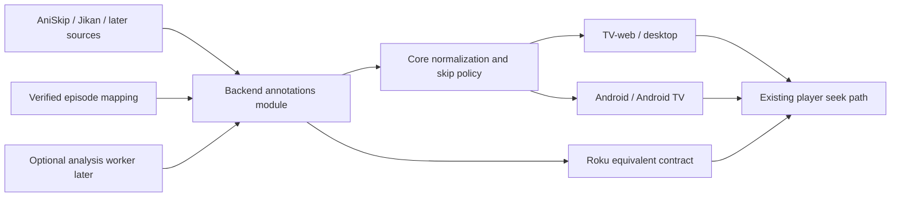

# EPISODE-ANNOTATIONS-001 — Intro/outro skipping and filler implementation plan

Status: **proposed implementation plan**, 2026-10-07. The owner requested a plan based on the completed source research. This document sets recommended scope, interfaces, sequencing and acceptance; it does not approve production activation, change the behavioral baseline or serve as a complete UI reconstruction specification.

Planning baseline: design `76ab36da2ad16896deb027d7af1f1c2250da3b6a`, [BE-002](../backend-v2/BACKEND_V2.md), [shared core](../../docs/architecture/SHARED_CORE.md), [player controls](../../viptv-design-system/components.md#10-player-controls), [Roku interaction contract](../../specs/behavior/roku-ux-contract.md), and [design synchronization](../../docs/process/DESIGN_SYNC.md). The [supporting research](https://github.com/viptv-org/workspace/blob/main/docs/research/episode-annotations/episode-segments-and-filler.md) includes three source investigations dated 2026-10-07. Links to decisive upstream contracts appear below. Implementation must reference the full reviewed design commit produced after the normative feature specification and visual artifacts are complete.

## 1. Intended outcome and first release

Viewers can identify a positively annotated filler or recap episode in series Details and skip a validated opening/ending interval during playback. An unavailable annotation never prevents watching. The feature is native across VIPTV clients; replaceable backend adapters supply metadata.

**Release 1:** deterministic anime identity resolution, AniSkip timestamps, Jikan positive filler/recap labels, backend annotation storage, shared normalization/seek decisions, episode badges and explicit skip controls. Browser/desktop is the first integrated validation slice, Android phone/TV follows, and Roku has a separate implementation. Tizen and Vizio share TV-web logic but need separate device evidence. No platform is described as supported merely because another shares its code.

**Release 1b:** TheIntroDB for general-TV/movie markers after terms and coverage checks. The marker contract supports movies from the start; filler labels remain episode metadata.

**Later:** opt-in automatic opening/ending skipping, filler-aware autoplay, Anime Skip's richer segments, matched-release AniLiberty data, and asynchronous actual-media analysis. These are independently gated additions.

First-release exclusions: automatic recap/preview skipping, automatic mixed opening/credits skipping, whole-episode hiding, changed watch completion rules, title-only guessing, a user plugin marketplace, browser extensions, third-party player embeds, media scanning during playback startup, live IPTV markers, and production deployment.

## 2. Decisions carried forward from research

| Decision | Reason / condition |
| --- | --- |
| Native product behavior with backend adapters | Consistent controls and preferences across web, Android, desktop and Roku; adapters can be replaced without distributing third-party executable plugins |
| AniSkip first for anime markers | MAL + episode + runtime lookup provides explicit intervals; its ±20-second filter is evidence, not proof of an identical cut |
| Jikan first for positive filler/recap observations | Episode flags align with MAL IDs; absence of a badge is not confirmed canon |
| TheIntroDB next for general media | TMDB/IMDb and duration-based lookup; multiple intro/recap/credits/preview intervals |
| Anime Skip as secondary | Richer segment taxonomy, but registered client ID, alternate identity join and timestamp-boundary conversion increase scope |
| Fribb is an optional mapping input | Useful joins/offsets, not definitive episode correspondence; shipping a snapshot depends on merged-data rights clarification |
| SkipDB excluded from initial private storage and benchmarking | Its declared data terms add reciprocity for certain imports/merges/validation/benchmarks; reconsider with an agreed open-data model or written permission |
| Streaming wrappers and theme catalogs are references | Upstream stream markers and reference clips do not establish reusable, edition-matched annotation coverage |

Sources: [AniSkip implementation](https://github.com/aniskip/aniskip-api), [Jikan badge parser](https://github.com/jikan-me/jikan/blob/master/src/Parser/Anime/EpisodeListItemParser.php#L137), [TheIntroDB functions](https://theintrodb.github.io/theintrodb-npm/functions.html), [Anime Skip schema](https://github.com/anime-skip/public-api/tree/main/api), [Fribb contract](https://github.com/Fribb/anime-lists), [SkipDB data terms](https://github.com/SkipDB-TV/skipdb/blob/main/DATA-LICENSE).

Hosted API/data permissions are separate from repository code licenses. Implement adapters and acceptance fixtures while permissions are being resolved; leave each unresolved external adapter disabled for production. No scraping fallback is authorized by an API miss.

## 3. Ownership and module interface

The backend owns an **episode annotations module**. Its small interface accepts an authorized exact item or playback context and returns normalized annotation facts. Identity resolution, upstream requests, validation, candidate selection, caching and provenance belong in its implementation. Clients never select an upstream or submit a media URL to a timestamp provider.

| Owning repo | Planned change |
| --- | --- |
| `design` | Normative behavior, copy, canvas exports, focus/timing, accessibility, acceptance and immutable adoption |
| `backend` | Authorization, exact identity resolver, adapters, observations/cache, normalized routes, provider controls and eventual preferences/continuation changes |
| `core` | Generated annotation types, raw-response validation, active segment/seek decisions, lifecycle fences and later auto-skip suppression |
| `tv-web` | Bounded visible-episode enrichment, badges, responsive/TV skip controls and core-driven player actions |
| `desktop` | Adopt the exact TV-web/core revision and verify the installed native seek path |
| `android` | Adopt native core/bindings, lazy-row badges, touch/remote controls and Media3 seek lifecycle |
| `roku` | Implement the same normalized rules and acceptance vectors without assuming production core adoption |
| `video` / `tauri-video-plugin` | Change only if existing time/duration/seek observations lack required facts; no source discovery or provider lookup |
| `playback-gateway` | No annotation identity or filler policy; any missing generic timeline fact gets a separately scoped contract change |
| `web` | No account/admin screen in Release 1; operator or correction UI needs its own design scope |

Do not couple feature activation to the ongoing v2 cutover or infer that cutover qualification/deployment is complete. Preserve the existing start, heartbeat, release, native-grant and playback-protocol wire shapes. Annotation reads are additive and optional. Current preferences already include profile-scoped autoplay; current core owns bounded seeks and Up Next suppression. Extend those owners later rather than introducing competing policy loops. Inspect source again at implementation because branches/pins can advance.

## 4. Identity and normalized facts

### Identity resolver

Use the existing backend's exact item context and source match. Resolve the tuple of external title ID, media kind, episode ordering scheme, external episode number, and mapping revision. Retain the original VIPTV episode ID.

Accept trusted explicit MAL IDs first. Otherwise accept a verified cross-catalog mapping with season/cour/special/offset evidence. Missing, conflicting or fractional episode mappings return `unmapped`; never round ordinals, use row indices, infer the next episode by incrementing a number, or select the first title-search result. AniSkip relation rules can assist a verified MAL join but cannot repair an ambiguous title match.

Fribb is not a prerequisite for delivering the module: the pilot can begin with trusted explicit external IDs and synthetic verified mappings. If its terms or joins remain unresolved, reduce coverage rather than silently substitute a scraper.

### Classification observation

Store upstream `filler` and `recap` flags separately, with external episode identity, source record, observation time and mapping revision. For Jikan, true supplies a positive label; false supplies an unmarked observation. Public Release 1 labels are `Filler` and/or `Recap`; unmarked/unknown has no badge. A future richer source can establish `mixed`, `manga_canon` or `anime_canon` without rewriting the meaning of existing Boolean observations.

### Marker observation and selected segment

Preserve upstream type, original units, record ID, bounds, reference duration and retrieval time. Normalize usable segments to integer `start_ms` and `end_ms` on the **original media timeline**, plus normalized kind, `contains_story`, match evidence and annotation revision.

First-release kinds are opening/ending and their mixed variants. Store recap/preview evidence for later behavior without rendering new actions. A valid manual-skip candidate requires exact episode mapping, compatible known runtime, finite increasing bounds within media duration, and an established source-to-player time mapping. Missing runtime or disputed edition leaves evidence stored but supplies no actionable segment.

Applicability includes opaque source revision, relevant language/edition evidence when known, and duration. Runtime equality alone does not establish an identical edit. Mixed candidates are never silently normalized to ordinary openings/endings; the normative design must identify their story overlap before exposing any manual action.

Select one consistent provider observation for a given logical segment; retain conflicting candidates internally. Do not union overlaps, invent a constant offset or proportionally rescale a timeline to force applicability. Edition-bound, authorized corrections may outrank external data in a later correction feature; no correction/admin UI is included here.

## 5. Proposed HTTP interface and compatibility

Exact JSON names and authorization-reference encoding are finalized in the backend/core contract work package. The following route shapes are the implementation target, not existing endpoints:

| Route | Input / purpose | Response behavior |
| --- | --- | --- |
| `POST /api/v2/episode-annotations` | Read annotations for at most 50 visible exact episode references from an authorized catalog/addon context | Version 1 envelope with one result per requested reference; classification status/positive labels only; no media lookup or stream discovery |
| `GET /api/v2/playback/{playback_id}/annotations` | Authorized active playback; backend derives item and selected source; optional bounded `duration_ms` observation | Version 1 envelope with item, source/annotation revision, status and validated selected segments |

The batch route must revalidate its existing catalog/addon context; it is not a general external-ID proxy or an arbitrary title resolver. Every requested reference is bounded and validated before work is queued. Duplicate references are coalesced without changing response correspondence. The optional duration is a strictly parsed integer observation from the current player (proposed range: 1..86,400,000 ms); it supports direct playback when no backend probe duration exists. It is not trusted identity/edition authority and must not replace a conflicting trusted duration. Missing, invalid or conflicting duration supplies no actionable marker. Only backend-derived item/source context selects an upstream lookup.

Separate status for classification and markers: `ready`, `pending`, `not_found`, `unmapped`, `unsupported`, `temporarily_unavailable`. `ready` does not imply every supported annotation exists. Provider failure never produces an authoritative negative classification. Internal failures use safe codes without raw upstream payloads.

Server responses are bounded, use `Cache-Control: no-store` on account/profile-scoped routes, and contain no upstream media URLs or credentials. Server-side permitted annotation caching is separate from browser/CDN caching. Auth/scope/terminal-playback failures follow existing nondisclosure and recovery rules; they must not be cached as source misses.

Old clients do not request the routes. New clients receiving route absence disable the optional feature for that backend/authenticated generation; malformed data also disables annotations without breaking playback. No fields are appended to the existing closed playback protocol response. Unknown annotation envelope versions are unsupported, never coerced. Normalization follows core's raw-input validation and byte-bound conventions.

On a cache miss, reads enqueue coalesced work and return `pending` immediately. Proposed client budget: an initial request plus at most two follow-ups at elapsed 1 and 3 seconds from that initial request for an unchanged visible/playback generation. No annotation polling on every media tick. If still pending, omit the action/badge for that view; a later view entry may retry. Inject clocks/budgets into tests. A runtime becoming known permits one fresh playback-generation request with the observed duration; it does not restart an unbounded retry loop. Polls preserve the same validated duration/key, and transient player-clock variations must not create distinct upstream jobs.

## 6. Storage, limits and operations

Proposed additive records: verified identity mappings; upstream observations; selected revisioned annotation sets; and later scoped correction records. Do not mutate existing history or source identity tables to encode filler.

Cache keys include external identity/order, reference runtime where relevant, adapter/schema version and mapping revision. Store edition-specific applicability separately. Private source evidence and corrections stay in their account scope; permitted public observations can be shared without sharing account playback activity.

Initial configurable budgets, to confirm in the pilot: positive freshness 24 hours, valid no-data freshness 1 hour, provider-error backoff beginning at 60 seconds, upstream total request deadline 5 seconds, two concurrent calls per provider, and a bounded queue of 200 unique lookup jobs. Pagination is scheduled through the same provider budget rather than spawned concurrently for an entire anime. Honor tighter provider terms, retry-after and advertised limits; Jikan's own 24-hour cache limits freshness regardless of local retries.

For first-release AniSkip/Jikan, start at no more than 30 upstream requests/minute per provider across a deployment, below inspected published/default limits. Multi-instance deployments need a shared limiter or a single designated enrichment worker. Limits are enforced at deployment level, not independently multiplied per process. Job queue saturation returns temporary annotation unavailability and never consumes media-playback admission.

Persist completed permitted observations and expiries; worker restart may discard unfinished jobs and retry only on demand. Use idempotent keys to avoid duplicate observations. Source/mapping changes invalidate applicability even if TTL remains fresh. Bounded pruning/retention follows approved data terms; no unlimited raw-response archive.

Per-adapter controls: disabled, internal pilot, enabled. Rollout controls distinguish annotation reads, classification UI, manual skipping, later automatic skipping and later filler-aware continuation. Disabling one provider removes its actionable segments immediately and preserves all ordinary playback/history. Aggregate metrics cover lookup hit/miss/unmapped/error, queue/rate consumption, candidate rejection reason, annotation latency and safe seek outcomes. Never log media URLs, raw private IDs, tokens or per-household viewing trails.

## 7. Behavior to specify before UI implementation

The next design work package must create `specs/behavior/episode-annotations.md`, update canonical copy/components, and export the affected canvas states. This plan intentionally does not invent pixel measurements. UI work is ready only when the following are specified in the reviewed immutable contract:

- Entry: a positively labelled episode in Details, or current playback entering a valid interval. Exit: interval end, source/item/profile change, non-seekable state, or player close.
- Copy target: `Filler`, `Recap`, `Skip intro`, `Skip outro`; accessible names `Skip intro` / `Skip outro` and episode badges announced with episode context. Mixed-content wording requires explicit design disposition.
- Loading/miss/error: no global spinner, toast or playback error for optional annotation failure. No badge or skip control until usable facts exist. Restore normal playback on failed seek using existing `The stream could not seek there.` notice.
- Placement: exact portrait, desktop and TV coordinates/touch targets from the existing player/episode design; collision rules for captions, tools and Up Next; long titles, large text and narrow cards; reference inventory hashes.
- Input: one activation per OK/Enter/tap/pointer click; held OK and repeats cannot seek repeatedly; arrows preserve existing focus/seek meaning. Back retains existing overlay/player behavior. No forced focus capture when a marker arrives.
- Restoration: action disappearance returns focus to an explicitly defined surviving player control only if the disappearing action was focused. Details enrichment preserves season, scroll, recycled-card identity and saved focus.
- Timing: exact interval eligibility uses `start_ms <= original_position_ms < end_ms`; disappear at interval end. Seek in flight blocks another segment action. Late annotations may become eligible only for the current interval and generation.
- Outcome: skip seeks to interval end through the ordinary direct/managed/native path, preserves play/pause state, and does not select another source or episode. Seek success/failure/cancellation follows player observations, not optimistic time assignment.
- History: no new watched event is emitted by annotation reads or a skip action. Ordinary authoritative progress/completion still applies; an outro seek reaching the existing completion threshold can trigger current semantics without changing that threshold. Never jump to the next episode merely because an outro marker exists.
- Platforms: desktop/browser keyboard and pointer, Android touch/remote/accessibility, Roku remote, Tizen and Vizio; state explicitly which evidence is emulator/host versus physical device.

Until this specification exists, backend/core work can use fixtures, but visible UI cannot claim design adoption or cross-platform parity.

## 8. Delivery work packages and dependencies

These are planned scopes for the existing GitHub issue workflow, not a second execution tracker. No tickets or remote comments were created by this planning task. Searches of design/backend/core/TV-web issues found no dedicated episode-annotations feature; existing platform parity tickets still apply. Re-search before publishing implementation issues. Each eventual issue references the full design SHA and its acceptance IDs; use existing triage labels.

| Phase / scope | Owner(s) | Deliverable and exit gate | Depends on |
| --- | --- | --- | --- |
| P0 — Provider permission and catalog pilot | workspace coordination + backend | Per-provider terms/caching/attribution disposition; 60 episode samples spanning 10 anime and varied numbering/cuts; 20 general-media samples for TheIntroDB when permitted; recorded ground truth, coverage and boundary errors | Research |
| P1 — Normative feature design | design | Complete behavior/copy/geometry/focus/timing and canvas exports; stable acceptance IDs and reviewed immutable revision | Plan; P0 evidence informs applicability rules |
| P2 — Annotation foundation | backend | Additive storage/migration, scoped resolver/routes, strict versioned DTOs, deterministic fixtures, queue/budgets, disable controls; no existing playback wire changes | P1 data contract; external enablement waits for P0 |
| P3 — AniSkip and Jikan adapters | backend | Bounded HTTP adapters, paging, coalescing, source-specific misses, runtime/type conversion and provenance | P2; P0 for external pilot/activation |
| P4 — Shared decisions and bindings | core | Annotation normalization, eligible manual action, bounded seek intent, scope/session fences; native + actual-WASM vectors; regenerated Kotlin/TypeScript/WASM | P2 versioned contract; P1 behavior |
| P5 — Browser/desktop vertical slice | tv-web + desktop | Visible bounded batch enrichment, badges/manual actions, HTTPS integration, installed native seek check; adopt exact design/core revisions | P3 + P4; P1 visual artifacts |
| P6 — Native/TV adoption | android + roku + tv-web | Android phone/TV, Roku, Tizen and Vizio implementation/evidence; per-platform parity record and explicit unsupported cases | P5 integrated contract; device windows coordinated |
| P7 — General-media lookup | backend + clients as needed | TheIntroDB Rust HTTP adapter, multi-interval/null-end conversion and movie applicability; same manual UI contract | P0 general-media gate + P2; no npm runtime required |
| P8 — Opt-in automation | design + backend + core + clients | Profile preferences, automatic-skip suppression, filler-aware continuation specification and implementation; separate rollout controls | Qualified manual feature and measured conservative thresholds |
| P9 — Optional detection | separately scoped worker + backend | Authorized file cohort, chapter/audio/visual detector prototype, bounded admission/cancellation, edition-bound evidence | Demonstrated lookup gaps; separately accepted analysis contract |

P0 and P1 can progress together. P3 and P4 can progress independently after P2's interface is frozen. P6 client work can progress independently after the first vertical slice establishes the shared contract. No calendar promise or concurrency assumption replaces each repo's resource limits and device coordination.

## 9. Pilot and acceptance gates

Pilot selection must include long-running filler series, separate MAL cours, specials/OVAs, sparse/duplicate episode numbers, sub/dub, differing recaps/logos/edits and post-credit scenes. Report actual sample size and denominator per source. A missing marker is a coverage miss; an incorrect marker is an accuracy failure. Do not privately benchmark SkipDB data until its additional terms have a compatible workflow.

Proposed manual-release gate: every exposed pilot candidate has the correct episode and a human-checked end that preserves story content; record start/end errors separately. Unsafe or disputed candidates are withheld. Low coverage can ship as partial coverage if omissions are harmless and stated; a runtime-compatible wrong cut cannot be papered over as a small miss. A finite sample provides scoped evidence, not a guarantee. Automatic skipping needs its own broader evidence threshold during P8.

| Acceptance ID | Scenario and required result |
| --- | --- |
| EA-01 | Exact MAL episode with compatible runtime returns a bounded marker; missing/conflicting IDs return unmapped without fuzzy fallback |
| EA-02 | Jikan true shows positive filler/recap; false, absent labels and lookup failure never show confirmed canon; pages preserve external episode numbers |
| EA-03 | NaN/negative/reversed/out-of-duration bounds, wrong units, mixed-type erasure, duplicate/unknown envelope fields and oversized responses are rejected |
| EA-04 | Direct original-time seek and managed output starting at minute ten reach the same absolute endpoint; unknown mapping supplies no action |
| EA-05 | Account/profile/item/source/mapping/lease change during request rejects late results; foreign/terminal playback leaks no annotations |
| EA-06 | Marker arrives while another control is focused; no focus theft. Focused action expires; restore defined control. Remote hold/repeat invokes one seek |
| EA-07 | Provider timeout/429/no-data/queue saturation permits uninterrupted playback; coalescing and deployment-wide rate bounds hold under concurrent viewers |
| EA-08 | Failed or canceled seek retains existing player recovery and truthful position; paused skip remains paused; in-flight replacement cannot issue a duplicate seek |
| EA-09 | Outro ends before a post-credit scene: skip reaches the outro end and preserves the scene; current completion/Up Next rules remain authoritative |
| EA-10 | Lazy episode rows receive delayed badges without scroll/focus changes; profile/season switch rejects stale badge updates; visible batches remain bounded |
| EA-11 | Old backend route absence and feature/provider disablement remove optional controls while start/heartbeat/release, history and autoplay continue unchanged |
| EA-12 | Additive schema migration preserves accounts/preferences/history/source IDs; disabling/reverting feature code works with retained annotation tables |

Run owning-repo checks and focused scenario coverage: design `python3 scripts/validate.py`; backend `cargo test --manifest-path server/Cargo.toml`; core Rust plus generated native/actual-WASM checks; TV-web typecheck/test/build and relevant HTTPS Playwright scenarios; Android documented host/unit and APK checks with one expensive build worker; Roku runtime/contract/compiler/package checks. Video/plugin checks run only if those repos change. Coordinate local HTTPS and physical-device windows before starting them.

## 10. Later automation constraints

Automatic opening/ending preferences default off and remain profile-scoped. Settings changes apply to subsequent playback; snapshot preferences on playback entry. Do not add fields casually to existing closed preference DTOs: use a negotiated/versioned preference extension or a separate annotation-preferences route designed in P8, preserving existing clients.

Only edition-verified eligible nonmixed intervals can auto-skip. A user seeking back into a skipped interval suppresses its automatic skip for the rest of that playback; reopening, source replacement and episode transitions require explicit reset rules. A pending/failed seek does not re-fire every tick. Live, unknown identity/runtime, disputed cuts and unseekable paths remain ineligible.

Filler-aware autoplay resolves an explicitly filtered successor through backend continuation, not client-side episode-number arithmetic. Preserve ordinary Next episode, manual episode selection, watched history and Resume. Skip only positively classified whole-episode filler; mixed/unknown remains. Return distinct caught-up, upcoming, unavailable and bounded-search-incomplete results. A proposed initial search budget is 50 real successor entries; exhausting it never falsely reports caught-up. Cache the result with profile preference/classification/mapping/catalog revisions so a changed setting cannot reuse a stale successor. Specification must settle the visible action/copy and how unavailable filler versus unavailable non-filler successors behave before implementation.

Optional analysis is a separate worker experiment inspired by Intro Skipper, not a Jellyfin plugin dropped into Rust. Start with authorized seekable files and known episode cohorts; measure CPU/I/O/cancellation and false positives. Store media-version-bound results behind the existing annotations interface. The generic playback gateway does not acquire MAL/TMDB identity or editorial filler policy.

## 11. Completion and remaining decisions

The plan is complete when ownership, sequencing, proposed interfaces and acceptance are reviewable. Implementation completion requires an immutable normative design revision, linked owning-repo issues, verified source permissions, checked artifacts and independent client/device adoption evidence. Publishing a build or passing host tests alone does not establish production activation or TV support.

Remaining work belongs to named phases: provider terms (P0), exact catalog joins and measured coverage (P0/P2), canonical skip/badge geometry and mixed-content disposition (P1), final strict DTO/status encoding (P2/P4), device windows (P6), automation preferences and filtered-next semantics (P8), and actual-media access/compute model (P9). These are concrete prerequisites for the relevant phase, not reasons to abandon fixture-backed design and implementation.

Immediate next implementation slice after normative contract review: P2 annotation foundation with injected sources and synthetic fixtures, then P3 AniSkip/Jikan adapters plus P4 shared decisions. No production migration, deployment, credential provisioning or provider write is part of this plan.
